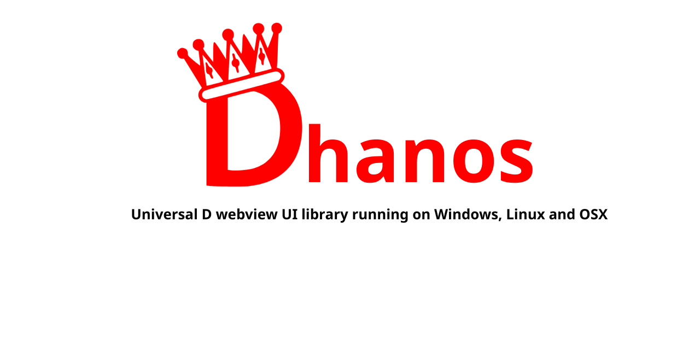

# Dhanos

Dhanos is a D bind of https://github.com/zserge/webview

# Building

## Linux

### Prerequisites

- Install DMD using the .deb on the dlang website
    - or through your package manager, but don't install GDC!!
- `sudo apt install build-essential webkit2gtk-4.0`
- cd Examples/Minimal
- dub

## Windows

TODO

## OSX

TODO

# TODO

Basic idea is to replace webview.c with a full D version
